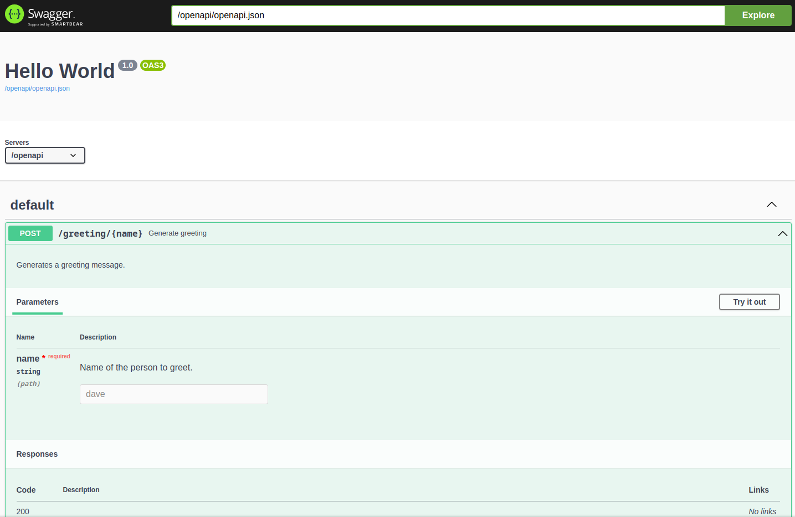

Quickstart
==========

Installation
------------

You can install connexion using pip:

.. code-block:: bash

    $ pip install connexion

Connexion provides 'extras' with optional dependencies to unlock additional features:

- :code:`flask`: Enables the :code:`FlaskApp` to build applications compatible with the Flask
  ecosystem.
- :code:`swagger-ui`: Enables a Swagger UI console for your application.
- :code:`uvicorn`: Enables to run the your application using :code:`app.run()` for
  development instead of using an external ASGI server.

You can install them as follows:

.. code-block:: bash

    $ pip install connexion[<extra>]
    $ pip install connexion[<extra1>,<extra2>].

Creating your application
-------------------------

Connexion can be used either as a standalone application or as a middleware wrapping an existing
ASGI (or WSGI) application written using a different framework. The standalone application can be
built using either the :code:`AsyncApp` or :code:`FlaskApp`.

- The :code:`AsyncApp` is a lightweight application with native asynchronous support. Use it if you
  are starting a new project and have no specific reason to use one of the other options.
- The :code:`FlaskApp` leverages the `Flask` framework, which is useful if you're migrating from
  connexion 2.X or you want to leverage the `Flask` ecosystem.
- The :code:`ConnexionMiddleware` can be wrapped around any existing ASGI or WSGI application.
  Use it if you already have an application written in a different framework and want to add
  functionality provided by connexion

.. tab-set::

    .. tab-item:: AsyncApp
        :sync: AsyncApp

        .. code-block:: python
            :caption: **app.py**

            from connexion import AsyncApp

            app = AsyncApp(__name__)

        .. dropdown:: View a detailed reference of the options accepted by the :code:`AsyncApp`
            :icon: eye

            .. autoclass:: connexion.AsyncApp
                :noindex:

    .. tab-item:: FlaskApp
        :sync: FlaskApp

        .. note::
            To leverage the :code:`FlaskApp`, make sure you install connexion using the
            :code:`flask` extra.

        .. code-block:: python
            :caption: **app.py**

            from connexion import FlaskApp

            app = FlaskApp(__name__)

        .. dropdown:: View a detailed reference of the options accepted by the :code:`FlaskApp`
            :icon: eye

            .. autoclass:: connexion.FlaskApp
                :noindex:

    .. tab-item:: ConnexionMiddleware
        :sync: ConnexionMiddleware

        .. code-block:: python
            :caption: **app.py**

            from asgi_framework import App
            from connexion import ConnexionMiddleware

            app = App(__name__)
            app = ConnexionMiddleware(app)

        You can also wrap a WSGI application leveraging the :code:`a2wsgi.WSGIMiddleware`:

        .. code-block:: python
            :caption: **app.py**

            from wsgi_framework import App
            from connexion import ConnexionMiddleware
            from a2wsgi import WSGIMiddleware

            wsgi_app = App(__name__)
            asgi_app = WSGIMiddleware(wsgi_app)
            app = ConnexionMiddleware(asgi_app)

        .. dropdown:: View a detailed reference of the options accepted by the
            :code:`ConnexionMiddleware`
            :icon: eye

            .. autoclass:: connexion.ConnexionMiddleware
                :noindex:

Registering an API
------------------

While you can register individual routes on your application, connexion really shines when you
register an API defined by an OpenAPI (or Swagger) specification.

.. grid::
    :padding: 0

    .. grid-item:: **run.py**

        .. code-block:: python

            def post_greeting(name: str):
                return f"Hello {name}", 200

            app.add_api("openapi.yaml")

    .. grid-item:: **openapi.yaml**

        .. code-block:: yaml

            openapi: "3.0.0"
            info:
              title: Greeting application
              version: 0.0.1
            paths:
              /greeting/{name}:
                post:
                  operationId: run.post_greeting
                  responses:
                    '200':
                      description: "Greeting response"
                      content:
                        text/plain:
                          schema:
                            type: string
                  parameters:
                    - name: name
                      in: path
                      required: true
                      schema:
                        type: string

The operation described in your specification is automatically linked to your Python view function
via the :code:`operationId`. You can change this behavior using different :code:`Resolvers`, see
:doc:`routing`. When the endpoint is called, connexion will take care of routing, security,
request body and parameter parsing, and response serialization. All based on the specification.

You can add as many APIs as you want to a single application. The :code:`add_api()` method
provides a lot of configuration options. When an option is provided both to the App and the API,
the API value will take precedence.

.. dropdown:: View a detailed reference of the options accepted by the :code:`add_api()` method
    :icon: eye

    .. tab-set::

        .. tab-item:: AsyncApp
            :sync: AsyncApp

            .. autofunction:: connexion.AsyncApp.add_api
                :noindex:

        .. tab-item:: FlaskApp
            :sync: FlaskApp

            .. autofunction:: connexion.FlaskApp.add_api
                :noindex:

        .. tab-item:: ConnexionMiddleware
            :sync: ConnexionMiddleware

            .. autofunction:: connexion.ConnexionMiddleware.add_api
                :noindex:

Running your application
------------------------

You can run your application using an ASGI server such as `uvicorn`. If you defined your
:code:`app` in a python module called :code:`run.py`, you can run it as follows:

.. code-block:: bash

    # assuming your application is defined as ``app`` in ``run.py``
    $ uvicorn run:app

Or with gunicorn (which is recommended in production).

.. code-block:: bash

    # assuming your application is defined as ``app`` in ``run.py``
    $ gunicorn -k uvicorn.workers.UvicornWorker run:app

See the `uvicorn documentation`_ for more details or check this
`overview of available ASGI servers`_ for other options.

.. _overview of available ASGI servers: https://asgi.readthedocs.io/en/latest/implementations.html#servers

If you installed connexion using :code:`connexion[uvicorn]`, you can run it using the
:code:`run` method. This is only recommended for development:

.. code-block:: python

    app.run()

To leverage automatic reloading of your application, you need to provide the application as an
import string. In most cases, this can be achieved as follows:

.. code-block:: python

    from pathlib import Path

    app.run(f"{Path(__file__).stem}:app")

.. dropdown:: View a detailed reference of the options accepted by the :code:`run()` method
    :icon: eye

    .. tab-set::

        .. tab-item:: AsyncApp
            :sync: AsyncApp

            .. autofunction:: connexion.AsyncApp.run
                :noindex:

        .. tab-item:: FlaskApp
            :sync: FlaskApp

            .. autofunction:: connexion.FlaskApp.run
                :noindex:

        .. tab-item:: ConnexionMiddleware
            :sync: ConnexionMiddleware

            .. autofunction:: connexion.ConnexionMiddleware.run
                :noindex:

.. _uvicorn documentation: https://www.uvicorn.org/deployment/

The Swagger UI
--------------

If you installed connexion using the :code:`swagger-ui` extra, a Swagger UI is available for each
API, providing interactive documentation. By default the UI is hosted at :code:`{base_path}/ui/`
where :code:`base_path`` is the base path of the API.

**https://{host}/{base_path}/ui/**

Check :doc:`swagger_ui` for information on how to configure the UI.

Full App class reference
------------------------

For more details on what you can do, view the complete API reference below.

.. tab-set::

    .. tab-item:: AsyncApp
        :sync: AsyncApp

        .. dropdown:: View a detailed reference of the :code:`AsyncApp`
            :icon: eye

            .. autoclass:: connexion.AsyncApp
                :members:
                :undoc-members:
                :inherited-members:

    .. tab-item:: FlaskApp
        :sync: FlaskApp

        .. dropdown:: View a detailed reference of the :code:`FlaskApp`
            :icon: eye

            .. autoclass:: connexion.FlaskApp
                :members:
                :undoc-members:
                :inherited-members:

    .. tab-item:: ConnexionMiddleware
        :sync: ConnexionMiddleware

        .. dropdown:: View a detailed reference of the :code:`ConnexionMiddleware`
            :icon: eye

            .. autoclass:: connexion.ConnexionMiddleware
                :members:
                :undoc-members:
