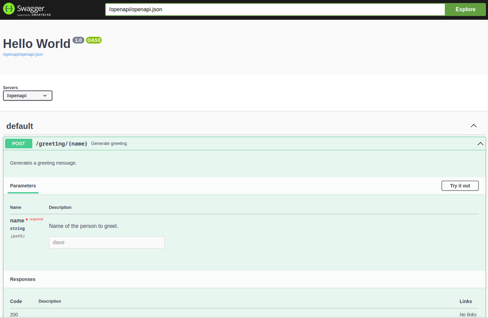

The Swagger UI
==============

If you installed connexion using the :code:`swagger-ui` extra, a Swagger UI is available for each
API, providing interactive documentation. By default the UI is hosted at :code:`{base_path}/ui/`
where :code:`base_path`` is the base path of the API.

**https://{host}/{base_path}/ui/**

Configuring the Swagger UI
--------------------------

You can change this path through the ``swagger_ui_options`` argument, either whe instantiating
your application, or when adding your api:

.. tab-set::

    .. tab-item:: AsyncApp
        :sync: AsyncApp

        .. code-block:: python
            :caption: **app.py**

            from connexion import AsyncApp
            from connexion.options import SwaggerUIOptions

            options = SwaggerUIOptions(swagger_ui_path="/docs")

            app = AsyncApp(__name__, swagger_ui_options=options)
            app.add_api("openapi.yaml", swagger_ui_options=options)

    .. tab-item:: FlaskApp
        :sync: FlaskApp

        .. code-block:: python
            :caption: **app.py**

            from connexion import FlaskApp
            from connexion.options import SwaggerUIOptions

            options = SwaggerUIOptions(swagger_ui_path="/docs")

            app = FlaskApp(__name__, swagger_ui_options=options)
            app.add_api("openapi.yaml", swagger_ui_options=options)

    .. tab-item:: ConnexionMiddleware
        :sync: ConnexionMiddleware

        .. code-block:: python
            :caption: **app.py**

            from asgi_framework import App
            from connexion import ConnexionMiddleware
            from connexion.options import SwaggerUIOptions

            options = SwaggerUIOptions(swagger_ui_path="/docs")

            app = App(__name__)
            app = ConnexionMiddleware(app, swagger_ui_options=options)
            app.add_api("openapi.yaml", swagger_ui_options=options):

For a description of all available options, check the :class:`.SwaggerUIOptions`
class.

.. dropdown:: View a detailed reference of the :code:`SwaggerUIOptions` class
    :icon: eye

    .. autoclass:: connexion.options.SwaggerUIOptions
